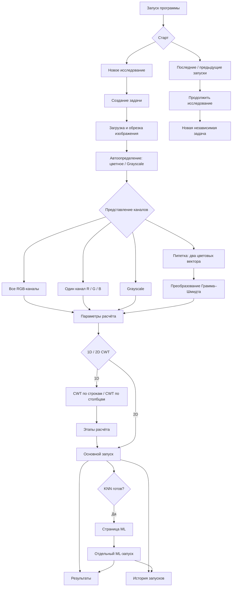

# Wavelets Analysis Studio

Настольная исследовательская студия для анализа изображений с помощью одномерного и двумерного преобразования Morlet CWT, поиска экстремумов, построения огибающих, формирования KNN-признаков, статистического анализа, сравнения результатов и отдельной ML-кластеризации.

## Запуск программы

```bash
python main.py
```

Для работы интерфейса, CPU-вычислений и ML:

```bash
python -m pip install -r requirements.txt
```

Для GPU-вычислений через CuPy и CUDA 12.x:

```bash
python -m pip install -r requirements-gpu.txt
```

Если CuPy недоступен, программа продолжает работать на CPU.

---

# Общая модель исследования

Каждая задача хранит собственные:

- изображение;
- представление цветовых каналов;
- режим 1D или 2D;
- масштабы;
- направления преобразования;
- параметры Morlet;
- выбранные этапы расчёта;
- форматы сохранения;
- параметры KNN и ML.

Каждый основной расчёт и каждый повторный ML-запуск получает отдельную папку.

История запусков хранится в SQLite.

---

# Основные разделы программы

В текущей версии используются пять основных страниц:

1. **Данные**
2. **Параметры расчёта**
3. **Результаты**
4. **ML**
5. **Предыдущие запуски**

Страницы «Результаты», «ML» и «Предыдущие запуски» создаются при первом открытии.

---


# Общая карта пользовательского сценария



Ожидаемые правила работы:

1. Основной запуск и повторный ML-запуск всегда получают разные каталоги.
2. Сценарий **«Подготовка данных для ML»** заканчивается на KNN.
3. Параметры ML доступны сразу после подготовки или восстановления KNN.
4. Изменение режима каналов инвалидирует ранее вычисленные результаты активной задачи.
5. Исходные RGB-данные не изменяются при выборе Grayscale или преобразования Грамма–Шмидта.
6. При продолжении исследования восстанавливается выбранная методика работы с каналами.
7. Новый вариант исследования создаётся как независимая задача и не изменяет исходный запуск.

---

# Данные и цветовые каналы

## Исходное изображение

После загрузки и, при необходимости, обрезки эффективное RGB-изображение сохраняется как исходный источник задачи.

При запуске расчёта оно копируется в папку запуска под именем:

```text
image.png
```

Исходные RGB-данные не перезаписываются при переходе к Grayscale или преобразованию Грамма–Шмидта.

## Явный выбор каналов

Поддерживаются следующие варианты.

### RGB

Можно анализировать:

- все каналы `R / G / B`;
- только один канал `R`, `G` или `B`.

### Grayscale

Используется один канал `Gray`.

При переводе цветного RGB-изображения в оттенки серого используется яркостная модель Rec.709:

```text
Y = 0,2126·R + 0,7152·G + 0,0722·B
```

где `R`, `G` и `B` — значения соответствующих цветовых каналов.

Промежуточное округление не выполняется.

### Преобразование Грамма–Шмидта

Используются три преобразованных канала:

```text
GS1
GS2
GS3
```

Пипетка позволяет выбрать два цветовых вектора для построения нового базиса.

**Само использование пипетки не переключает режим анализа автоматически.**

## Автоматическое определение Grayscale

После загрузки программа проверяет, насколько близки значения компонентов `R`, `G` и `B`.

Если RGB-файл фактически содержит изображение в оттенках серого, программа предлагает режим:

```text
Grayscale
```

Для обычного цветного изображения предлагается:

```text
RGB ×3
```

Это только рекомендуемое значение по умолчанию. Пользователь может изменить выбор вручную.

## Единый набор каналов для всего расчёта

Выбранные каналы используются одинаково на всех последующих этапах:

```text
CWT
→ экстремумы
→ огибающие
→ KNN
→ статистики
```

Для имён файлов используются короткие коды каналов:

```text
r
g
b
gray
gs1
gs2
gs3
```

---

# Одномерное преобразование Morlet CWT

Одномерное CWT может рассчитываться:

- по строкам;
- по столбцам;
- одновременно по строкам и столбцам.

Построчное и постолбцовое CWT являются независимыми наборами коэффициентов.

Внутри каждого из них точечный анализ также может выполняться:

- по строкам;
- по столбцам.

Если включены оба направления CWT, возможны четыре комбинации:

```text
CWT по строкам    × поиск признаков по строкам
CWT по строкам    × поиск признаков по столбцам
CWT по столбцам   × поиск признаков по строкам
CWT по столбцам   × поиск признаков по столбцам
```

В именах результатов отдельно сохраняются:

```text
cwt_axis
feature_axis
```

Например:

```text
ext_cwtrow_axiscol_g_s4_max
knn_cwtcol_axisrow_gray_s8_max_k5
```

Межстрочная синхронизация сохраняет отдельную построчную семантику и использует сочетание:

```text
Row CWT × axisrow
```

---

# Последовательность этапов 1D-анализа

Основная зависимость этапов:

```text
CWT
 ↓
экстремумы
 ↓
огибающие
 ↙       ↘
KNN    статистики
```

Доступные сценарии:

- **Только вейвлет**
- **Вейвлет и экстремумы**
- **Вейвлет, экстремумы и огибающие**
- **Огибающие и статистики**
- **Подготовка данных для ML**
- **Полный 1D-анализ**
- **Пользовательский**

Если пользователь включает этап, требующий предыдущих вычислений, необходимые этапы включаются автоматически.

Если обязательный предыдущий этап отключается, зависящие от него этапы также отключаются.

Выбор формата сохранения не управляет самим вычислением.

## Подготовка данных для ML

Сценарий выполняет:

```text
CWT → экстремумы → огибающие → KNN
```

**Кластеризация автоматически не запускается.**

После подготовки KNN пользователь переходит на отдельную страницу **ML**.

---

# Форматы результатов и внутренние численные данные

Для результатов CWT доступны следующие форматы пользовательского сохранения:

- PNG;
- TXT;
- NPY.

Для других этапов используются TXT, CSV и PNG в зависимости от типа результата.

Кроме выбранного пользователем экспорта программа автоматически сохраняет численные карты CWT для визуализатора в:

```text
previews/*.npy
```

Эти файлы:

- сохраняются в полном разрешении;
- не уменьшаются;
- сохраняют исходный тип чисел массива;
- создаются независимо от того, включён ли пользовательский экспорт NPY.

Поэтому крупные исследования могут занимать значительный объём диска.

---

# Двумерное преобразование Morlet CWT

Поддерживаются:

- масштабы;
- ориентации;
- параметр `ω₀`;
- анизотропность `γ`;
- CPU/GPU;
- выбранное представление каналов.
  
Используется комплексный двумерный вейвлет Morlet:

```math
\psi_{a,\theta}(x,y)
=
\frac{1}{a}
\left(
e^{i\omega_0 x_\theta/a}
-
e^{-\omega_0^2/2}
\right)
\exp\left[
-\frac{1}{2}
\left(
\frac{x_\theta^2}{a^2}
+
\frac{y_\theta^2}{a^2\gamma^2}
\right)
\right]
```

где повёрнутые координаты определяются как:

```math
x_\theta = x\cos\theta + y\sin\theta
```

Обозначения:

* $a$ — масштаб;
* $\theta$ — ориентация;
* $\omega_0$ — центральная частота Morlet;
* $\gamma$ — коэффициент анизотропии;
* $x_\theta$, $y_\theta$ — координаты после поворота на угол $\theta$.


Обозначения:

- `a` — масштаб;
- `θ` — ориентация;
- `ω₀` — центральная частота Morlet;
- `γ` — коэффициент анизотропии;
- `xθ`, `yθ` — координаты после поворота на угол `θ`.

Текущий 2D-режим пока является базовым: последующие этапы экстремумов, KNN и ML для 2D ещё не подключены.

---

# ML

ML выполняется как отдельный этап после подготовки KNN.

## Выбор данных для ML

Пользователь выбирает один набор KNN-признаков.

В его подписи указываются:

- канал;
- масштаб;
- тип точек;
- направление CWT.

## K-means

Настраиваются:

- число кластеров;
- случайное начальное состояние;
- набор признаков;
- стандартизация.

Для крупных наборов данных используется MiniBatch K-means.

## DBSCAN

Настраиваются:

- `eps`;
- `min_samples`;
- размер пространственного блока;
- перекрытие соседних блоков;
- максимальное число точек в блоке.

DBSCAN работает локально по пространственным областям изображения и формирует оценку аномальности.

## Повторные ML-запуски

После подготовки KNN можно многократно менять параметры ML и запускать кластеризацию без повторного расчёта CWT.

Каждый такой запуск получает отдельную папку и отдельную запись в истории.

---

# Просмотр результатов

Визуализатор работает с численными результатами в форматах:

```text
NPY
NPZ
CSV
TXT
```

PNG используется как готовое изображение, но не как основной численный источник данных.

Поддерживаются:

- сравнение двух результатов в панелях A/B;
- связанное масштабирование;
- перемещение области просмотра;
- отображение численного значения под курсором;
- модуль, фаза и действительная часть комплексных данных;
- многоуровневое отображение больших карт;
- ограниченный кэш численных данных;
- фоновая загрузка файлов;
- восстановление области просмотра;
- наложение численных слоёв.

## Накладываемые слои

Можно отображать поверх основной карты:

- экстремумы;
- огибающие;
- KNN;
- K-means;
- DBSCAN.

Поддерживаются:

- прозрачность;
- фильтрация ML-результатов;
- проверка совпадения исходного изображения;
- проверка размера данных;
- пространственная индексация плотных наборов точек.

---

# История запусков

История хранится в SQLite.

Для каждого запуска сохраняются:

- дата;
- состояние выполнения;
- длительность;
- задача;
- путь к исходному изображению;
- путь к папке результатов;
- режим анализа;
- выбранный сценарий;
- снимок настроек;
- сведения о ML;
- заметка исследователя.

Снимок настроек содержит в том числе:

- представление каналов;
- режим всех RGB или одного RGB-канала;
- выбранный одиночный канал;
- результат определения Grayscale;
- цвета для Грамма–Шмидта;
- масштабы;
- направления 1D;
- параметры Morlet;
- выбранные этапы;
- форматы сохранения;
- настройки KNN и ML.

Поиск и постраничный вывод сейчас выполняются в памяти среди последних **1000** записей.

---

# Продолжение исследования

Команда продолжения создаёт новую независимую задачу.

Если исходное изображение доступно, оно загружается автоматически.

Если файл отсутствует, настройки восстанавливаются, но изображение необходимо выбрать заново.

Контрольная точка признаков может восстановить:

```text
KNN
статистики
синхронизации
```

Полные массивы коэффициентов CWT в контрольной точке пока не сохраняются.

---

# Манифест запуска

Основной расчёт создаёт файл:

```text
manifest.json
```

Текущая версия этого файла пока минимальна.

В нём фиксируется выбранная методика анализа каналов:

```json
{
  "schema_version": 1,
  "channel_analysis": {
    "detected_color_type": "color",
    "representation": "rgb",
    "rgb_mode": "single",
    "rgb_single_channel": "G",
    "channels": ["G"],
    "channel_codes": ["g"],
    "summary": "G ×1"
  }
}
```

Полный манифест эксперимента с версиями окружения, фактически использованным CPU/GPU, типами чисел, контрольными суммами файлов, связями между запусками и перечнем созданных результатов пока остаётся задачей дальнейшего развития.

---

# Структура папок и правила именования

Корневая папка исследования:

```text
wavelet_studio_DD_MM_YYYY_HH_MM
```

Папка конкретного запуска:

```text
task_001_DD_MM_YYYY_HH_MM_SS_mmm_<id>
```

Масштабы:

```text
scales/scale_1
scales/scale_2
...
```

Имена новых файлов результатов формируются в ASCII.

Примеры:

```text
cwt1d_row_r_s1
cwt2d_xy_gray_s4_a45
ext_cwtrow_axiscol_g_s2_max
env_cwtcol_axisrow_gs1_s8_upper
knn_cwtrow_axisrow_r_s4_max_k5
```

---

# GPU и численная точность

Основной численный стандарт вычислительного конвейера — `float32`.
Он используется для CPU/GPU 1D CWT и входов последующих GPU-этапов;
2D Morlet сохраняет комплексные коэффициенты как `complex64`.

GPU (CUDA) является приоритетным backend. Если пользователь выбрал GPU,
но во время вычисления возникает инфраструктурная CUDA-ошибка (например,
недостаток видеопамяти, потеря устройства или несовместимость runtime/driver),
обычный режим выполняет контролируемый fallback на CPU. Ошибки алгоритма
(`ValueError`, `IndexError` и т.п.) fallback не маскирует.

В `manifest.json` сохраняется блок `computation`:

- `requested_backend`;
- `actual_backend` по вычислительным этапам;
- `dtype` по этапам;
- структурированные предупреждения `BACKEND_FALLBACK`;
- признак `strict_backend`.

Режим «Строгая воспроизводимость» запрещает автоматический переход GPU → CPU:
при инфраструктурной ошибке GPU расчёт останавливается.

CPU остаётся полностью рабочим резервным режимом и использует Numba и
мультипроцессинг в 1D CWT.

---

# Синхронизация

В коде реализована межстрочная синхронизация с использованием:

- Jaccard;
- Dice;
- Phi;
- блоков масштабов;
- допустимого смещения по X;
- матриц попарного сравнения;
- тепловых карт.

Однако в текущем пользовательском интерфейсе отдельного флажка этого этапа нет, и обычные сценарии расчёта синхронизацию не включают.

Поэтому сейчас это внутренняя экспериментальная возможность, а не обычный пользовательский этап.

---

# Тестирование

Основная команда запуска тестов:

```bash
python -m unittest discover -s tests -v
```

Для полного запуска тестов интерфейса должны быть установлены зависимости из `requirements.txt`, включая `customtkinter`.

Проверка синтаксической корректности проекта:

```bash
python -m compileall -q .
```

Особенно важные группы тестов:

- `test_pipeline_plan.py`
- `test_extrema_precision.py`
- `test_channel_analysis.py`
- `test_result_naming.py`
- `test_gram_schmidt.py`
- `test_ml_ui_state.py`
- `test_ml_clustering.py`
- `test_run_history.py`

---

# Ограничения

1. Полный переносимый манифест эксперимента пока не реализован.
2. Нет явной родословной между основным запуском и его ML-вариантами.
3. Нет автоматического перебора параметров и пакетной очереди расчётов с ML (программа может считать несколько задач подряд, но без последующей кластеризации).
4. Полные коэффициенты CWT не восстанавливаются из контрольной точки.
5. Автоматически сохраняемые численные CWT-карты могут занимать большой объём диска.
6. Допустимые численные расхождения между CPU и GPU пока формально не зафиксированы.
7. Алгоритм огибающих требует окончательного научного описания.
8. Полный последующий 2D-анализ пока не реализован.
9. Синхронизация не включена как обычный пользовательский этап.
10. Количественное сравнение нескольких запусков пока ограничено.
