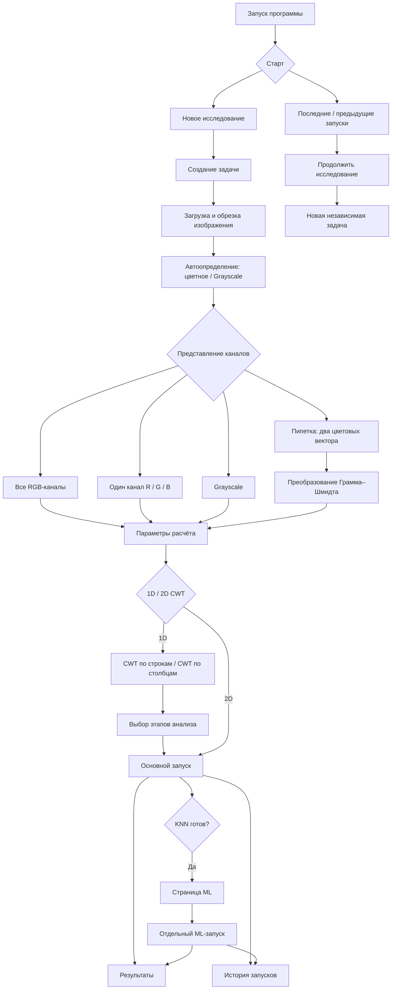

# Wavelets Analysis Studio — инструкция по эксплуатации

Wavelets Analysis Studio предназначена для исследования изображений с помощью 1D и 2D Morlet CWT, поиска экстремумов, построения огибающих, формирования KNN-признаков, статистического анализа и последующей ML-кластеризации.

---

## 1. Установка и запуск

Установите основные зависимости:

```bash
python -m pip install -r requirements.txt
```

Для GPU-вычислений через CuPy и CUDA 12.x дополнительно установите:

```bash
python -m pip install -r requirements-gpu.txt
```

Запуск программы:

```bash
python main.py
```

Если CuPy или совместимый GPU недоступны, программа может работать на CPU.

---

## 2. Общая карта пользовательского сценария



Основные правила:

1. Основной расчёт и повторный ML-запуск всегда сохраняются в разных каталогах.
2. Сценарий **«Подготовка данных для ML»** заканчивается на KNN.
3. Кластеризация запускается отдельно на странице **ML**.
4. После расчёта или восстановления KNN параметры ML должны быть доступны сразу.
5. Изменение режима каналов сбрасывает ранее вычисленные результаты активной задачи.
6. Исходные RGB-данные не изменяются при выборе Grayscale или Gram–Schmidt.
7. Продолжение старого исследования создаёт новую задачу и не изменяет исходный запуск.

---

## 3. Основные страницы программы

В текущей версии используются пять основных страниц:

1. **Данные** — загрузка и подготовка изображения.
2. **Параметры расчёта** — выбор CWT, масштабов, этапов и форматов сохранения.
3. **Результаты** — просмотр численных карт и дополнительных слоёв.
4. **ML** — K-means и DBSCAN по подготовленным KNN-признакам.
5. **Предыдущие запуски** — история, заметки и продолжение исследований.

---

## 4. Создание нового исследования

На стартовой странице выберите **«Новое исследование»**.

Будет создана отдельная задача. Каждая задача хранит собственные:

- изображение;
- канальное представление;
- режим 1D или 2D;
- масштабы;
- направления CWT;
- параметры Morlet;
- этапы анализа;
- параметры KNN и ML.

Можно работать с несколькими задачами в одной сессии. Их настройки и результаты не должны смешиваться.

---

## 5. Загрузка и подготовка изображения

Откройте страницу **«Данные»** и загрузите изображение.

При необходимости можно:

- использовать изображение целиком;
- выполнить прямоугольную обрезку;
- выполнить полигональную обрезку;
- выбрать два цвета пипеткой для Gram–Schmidt.

После подготовки итоговая область становится источником текущей задачи.

При запуске расчёта её копия сохраняется как:

```text
image.png
```

---

## 6. Выбор цветовых каналов

После загрузки программа оценивает, является ли изображение цветным или фактически содержит только оттенки серого.

Это рекомендация, а не автоматическое ограничение. Пользователь может изменить режим вручную.

### 6.1. Все RGB-каналы

Выберите:

```text
RGB ×3
```

если необходимо отдельно анализировать:

```text
R
G
B
```

Это основной режим для обычных цветных изображений.

### 6.2. Один RGB-канал

Можно выбрать только один канал:

```text
R
G
B
```

Этот режим уменьшает объём вычислений по сравнению с RGB ×3 и подходит, если исследование связано только с одним цветовым каналом.

### 6.3. Grayscale

Для изображений в оттенках серого рекомендуется использовать один канал:

```text
Gray
```

При переводе цветного изображения в Grayscale используется модель Rec.709:

```math
Y = 0.2126R + 0.7152G + 0.0722B
```

где `R`, `G` и `B` — исходные цветовые каналы, а `Y` — итоговая яркость.

Промежуточное округление не выполняется.

### 6.4. Gram–Schmidt

Для анализа в преобразованном цветовом пространстве:

1. выберите первый цвет пипеткой;
2. выберите второй цвет;
3. убедитесь, что цвета различимы;
4. вручную выберите режим **Gram–Schmidt**.

После преобразования используются:

```text
GS1
GS2
GS3
```

Важно: **сама пипетка не переключает режим анализа**.

---

## 7. Настройка расчёта

Перейдите на страницу **«Параметры расчёта»**.

Здесь задаются:

- CPU или GPU;
- режим 1D или 2D;
- масштабы;
- направления CWT;
- параметры Morlet;
- сценарий анализа;
- отдельные этапы;
- форматы сохранения результатов.

---

## 8. Выбор вычислительного устройства

Можно выбрать:

```text
CPU
```

или:

```text
GPU
```

если поддерживаемый GPU доступен.

GPU обычно ускоряет крупные расчёты. При ошибке GPU часть вычислений может быть продолжена на CPU.

Следует учитывать, что на некоторых этапах используются разные типы чисел:

```text
CPU: преимущественно float64
GPU: преимущественно float32
```

Поэтому очень небольшие численные различия между CPU и GPU возможны.

---

## 9. Масштабы

Масштабы можно задать диапазоном или загрузить из файла.

Пример диапазона:

```text
Начало: 1
Конец: 10
Шаг: 1
```

Полученный набор:

```text
1, 2, 3, ..., 10
```

Загружаемые значения должны быть положительными и конечными.

---

## 10. Работа в режиме 1D

В режиме 1D можно рассчитывать CWT:

- по строкам;
- по столбцам;
- одновременно в обоих направлениях.

### CWT по строкам

Каждая строка изображения рассматривается как отдельный одномерный сигнал.

### CWT по столбцам

Каждый столбец изображения рассматривается как отдельный одномерный сигнал.

### Оба направления

Если включены оба направления, создаются два независимых набора коэффициентов.

После этого поиск признаков также может выполняться по строкам и по столбцам. Возможны четыре комбинации:

```text
CWT по строкам    × признаки по строкам
CWT по строкам    × признаки по столбцам
CWT по столбцам   × признаки по строкам
CWT по столбцам   × признаки по столбцам
```

Эти результаты сохраняются раздельно.

---

## 11. Сценарии 1D-анализа

Основная последовательность этапов:

```text
CWT
 ↓
экстремумы
 ↓
огибающие
 ↙       ↘
KNN    статистики
```

Доступны готовые сценарии:

- **Только вейвлет**;
- **Вейвлет и экстремумы**;
- **Вейвлет, экстремумы и огибающие**;
- **Огибающие и статистики**;
- **Подготовка данных для ML**;
- **Полный 1D-анализ**;
- **Пользовательский**.

Программа автоматически контролирует зависимости между этапами.

Например, KNN не может использоваться без необходимых предыдущих вычислений.

### Подготовка данных для ML

Этот сценарий выполняет:

```text
CWT → экстремумы → огибающие → KNN
```

**Кластеризация автоматически не запускается.**

После завершения KNN необходимо перейти на страницу **ML**.

---

## 12. Экстремумы, огибающие, KNN и статистики

### Экстремумы

Можно находить:

- максимумы;
- минимумы;
- точки по строкам;
- точки по столбцам.

Результаты различаются по направлению CWT, направлению поиска, каналу, масштабу и типу экстремума.

### Огибающие

Огибающие строятся по найденным экстремумам и используются следующими этапами.

### KNN

Параметр `k` задаёт число соседей.

После успешного расчёта KNN его результаты становятся доступными для ML.

### Статистики

Статистические результаты сохраняются отдельно для разных сочетаний канала, масштаба и направления анализа.

---

## 13. Работа в режиме 2D

В режиме 2D используется комплексный двумерный Morlet CWT.

Настраиваются:

- масштабы;
- ориентации;
- `ω₀`;
- анизотропность `γ`;
- CPU или GPU;
- выбранные каналы.

Формула используемого двумерного вейвлета:

```math
\psi_{a,\theta}(x,y)
=
\frac{1}{a}
\left(
e^{i\omega_0 x_\theta/a}
-
e^{-\omega_0^2/2}
\right)
\exp\left[
-\frac{1}{2}
\left(
\frac{x_\theta^2}{a^2}
+
\frac{y_\theta^2}{a^2\gamma^2}
\right)
\right]
```

Поворот координат:

```math
x_\theta = x\cos\theta + y\sin\theta
```

```math
y_\theta = -x\sin\theta + y\cos\theta
```

Текущий 2D-режим предназначен прежде всего для построения численных карт CWT. Полный последующий анализ экстремумов, KNN и ML для 2D пока не реализован.

---

## 14. Запуск и сохранение результатов

После настройки параметров запустите расчёт.

Каждый основной запуск получает отдельную папку и не должен перезаписывать предыдущие результаты.

Для CWT доступны пользовательские форматы:

```text
PNG
TXT
NPY
```

Другие этапы могут использовать TXT, CSV и PNG.

Важно: **выбор формата сохранения не включает и не выключает этап вычисления**.

---

## 15. Внутренние численные карты

Программа автоматически сохраняет численные карты CWT для визуализатора в:

```text
previews/*.npy
```

Они создаются независимо от пользовательского экспорта NPY.

Эти файлы:

- полноразмерные;
- не уменьшаются;
- могут занимать значительный объём диска.

При большом количестве масштабов следите за свободным местом.

---

## 16. Просмотр результатов

Откройте страницу **«Результаты»**.

Поддерживается работа с численными файлами:

```text
NPY
NPZ
CSV
TXT
```

Можно:

- увеличивать и перемещать карту;
- смотреть значение под курсором;
- сравнивать два результата в панелях A/B;
- связывать масштабирование панелей;
- просматривать модуль, фазу и действительную часть 2D-результатов;
- накладывать дополнительные слои.

---

## 17. Дополнительные слои

Поверх основной карты можно отображать:

- экстремумы;
- огибающие;
- KNN;
- K-means;
- DBSCAN.

Для слоёв предусмотрены прозрачность, фильтрация и проверка совместимости с исходным изображением.

---

## 18. Работа с ML

Страница **ML** используется после подготовки KNN.

Если KNN отсутствует, ML-запуск недоступен.

После появления или восстановления KNN параметры ML должны быть доступны сразу — до первой кластеризации.

### Выбор KNN-набора

Если рассчитано несколько наборов KNN, выберите один из них.

В его подписи отображаются:

- канал;
- масштаб;
- тип точек;
- направление CWT.

### K-means

Настраиваются:

- число кластеров;
- случайное начальное состояние;
- используемые признаки;
- стандартизация.

Для очень больших наборов может автоматически использоваться MiniBatch K-means.

### DBSCAN

Настраиваются:

- `eps`;
- `min_samples`;
- размер пространственного блока;
- перекрытие соседних блоков;
- максимальное число точек в блоке.

DBSCAN работает по локальным пространственным областям изображения и может использоваться для оценки аномальности.

---

## 19. Повторные ML-запуски

После первого ML-анализа параметры можно менять и запускать ML повторно.

При этом:

- CWT не пересчитывается;
- KNN не пересчитывается;
- создаётся новая папка ML-запуска;
- создаётся новая запись истории;
- предыдущий ML-результат не перезаписывается.

---

## 20. История запусков

Откройте страницу **«Предыдущие запуски»**.

Здесь можно:

- искать исследования;
- фильтровать их по состоянию;
- менять страницу и число карточек;
- открывать результаты;
- сохранять заметки;
- продолжать исследования.

История хранится в SQLite.

---

## 21. Продолжение исследования

Команда **«Продолжить исследование»** создаёт новую независимую задачу на основе сохранённых настроек.

Исходный запуск при этом не изменяется.

Если исходное изображение доступно, оно загружается автоматически. Если файл отсутствует, необходимо выбрать изображение заново.

При наличии контрольной точки могут быть восстановлены:

```text
KNN
статистики
синхронизации
```

Это позволяет повторить ML без нового CWT.

Полные коэффициенты CWT в контрольной точке пока не сохраняются.

---

## 22. Манифест запуска

В папке основного запуска создаётся:

```text
manifest.json
```

В текущей версии он фиксирует прежде всего выбранную методику работы с каналами.

Пример:

```json
{
  "schema_version": 1,
  "channel_analysis": {
    "detected_color_type": "color",
    "representation": "rgb",
    "rgb_mode": "single",
    "rgb_single_channel": "G",
    "channels": ["G"],
    "channel_codes": ["g"],
    "summary": "G ×1"
  }
}
```

Полный научный манифест с версиями программы, зависимостей, CPU/GPU и контрольными суммами пока планируется к расширению.

---

## 23. Структура папок

Корневая папка исследования:

```text
wavelet_studio_DD_MM_YYYY_HH_MM
```

Папка отдельного запуска:

```text
task_001_DD_MM_YYYY_HH_MM_SS_mmm_<id>
```

Результаты по масштабам:

```text
scales/
├── scale_1/
├── scale_2/
└── ...
```

Внутренние численные карты:

```text
previews/
```

Примеры имён результатов:

```text
cwt1d_row_r_s1
cwt2d_xy_gray_s4_a45
ext_cwtrow_axiscol_g_s2_max
env_cwtcol_axisrow_gs1_s8_upper
knn_cwtrow_axisrow_r_s4_max_k5
```

---

## 24. Что делать, если расчёт не запускается

Проверьте:

1. загружено ли изображение;
2. заданы ли масштабы;
3. для 1D включено ли хотя бы одно направление CWT;
4. корректны ли введённые параметры;
5. выбран ли допустимый режим каналов;
6. для Gram–Schmidt выбраны ли два корректных цвета;
7. достаточно ли оперативной памяти;
8. не выполняется ли уже другой расчёт.

---

## 25. Что делать, если ML недоступен

Проверьте:

1. рассчитан ли KNN;
2. выбран ли сценарий, включающий KNN;
3. восстановлен ли KNN из контрольной точки;
4. завершился ли основной расчёт успешно;
5. выбран ли один набор KNN на странице ML.

Правильная последовательность:

```text
Подготовка данных для ML
→ KNN
→ страница ML
→ K-means или DBSCAN
```

---

## 26. Рекомендуемые сценарии

### Цветное изображение

1. Загрузите изображение.
2. Выберите `RGB ×3`.
3. Задайте масштабы.
4. Выберите направления CWT.
5. Выберите сценарий анализа.
6. Запустите расчёт.
7. Просмотрите результаты.
8. При наличии KNN перейдите к ML.

### Изображение в оттенках серого

1. Загрузите изображение.
2. Выберите `Gray ×1`.
3. Выполните расчёт.

Так не придётся трижды считать одинаковые RGB-каналы.

### Один цветовой канал

1. Загрузите цветное изображение.
2. Выберите RGB.
3. Выберите R, G или B.
4. Выполните расчёт.

### Gram–Schmidt

1. Загрузите изображение.
2. Пипеткой выберите два различимых цвета.
3. Выберите Gram–Schmidt.
4. Убедитесь, что используются `GS1`, `GS2`, `GS3`.
5. Выполните расчёт.

### Подготовка данных для ML

1. Загрузите изображение.
2. Выберите каналы.
3. Настройте 1D CWT.
4. Выберите **«Подготовка данных для ML»**.
5. Задайте `k` для KNN.
6. Выполните основной расчёт.
7. Перейдите на страницу ML.
8. Выберите KNN-набор.
9. Настройте K-means или DBSCAN.
10. Запустите ML.

---

## 27. Известные ограничения

В текущей версии:

1. полный переносимый манифест эксперимента ещё не реализован;
2. нет явной родословной между основным запуском и ML-вариантами;
3. нет автоматического перебора параметров и пакетной очереди;
4. полные коэффициенты CWT не восстанавливаются из контрольной точки;
5. внутренние NPY-карты могут занимать большой объём диска;
6. допустимое численное расхождение CPU/GPU пока формально не закреплено;
7. алгоритм огибающих требует окончательного научного описания;
8. 2D пока не имеет полного последующего анализа;
9. синхронизация остаётся внутренней экспериментальной возможностью;
10. количественное сравнение нескольких запусков пока ограничено.

---

## 28. Быстрый первый запуск

Если вы впервые работаете с программой, достаточно следующей последовательности:

```text
1. Запустить программу
2. Создать новое исследование
3. Загрузить изображение
4. Выбрать RGB / Gray / Gram–Schmidt
5. Открыть «Параметры расчёта»
6. Выбрать 1D или 2D
7. Задать масштабы
8. Выбрать сценарий анализа
9. Запустить расчёт
10. Открыть «Результаты»
11. Если рассчитан KNN — перейти на страницу ML
12. При необходимости продолжить исследование из истории
```

Для первого эксперимента рекомендуется использовать небольшое число масштабов. После проверки правильности параметров можно переходить к более крупному расчёту и GPU.
